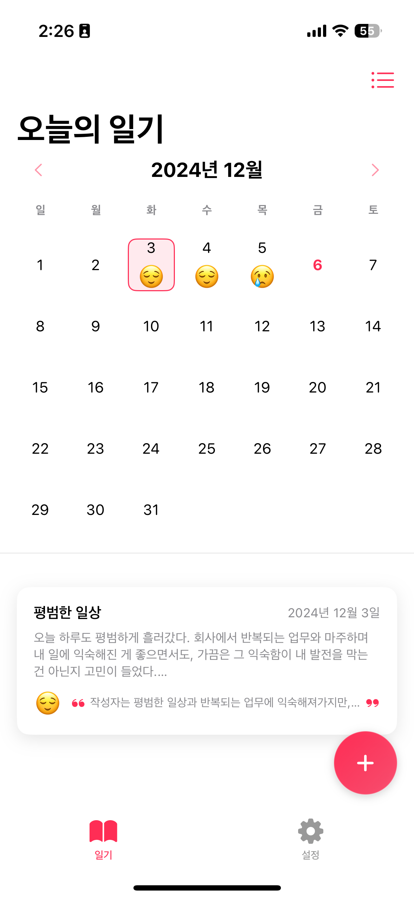
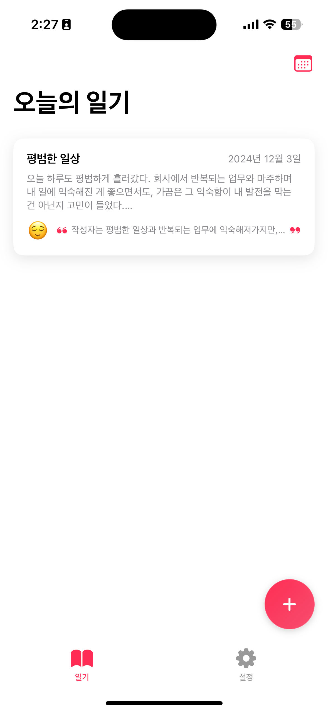
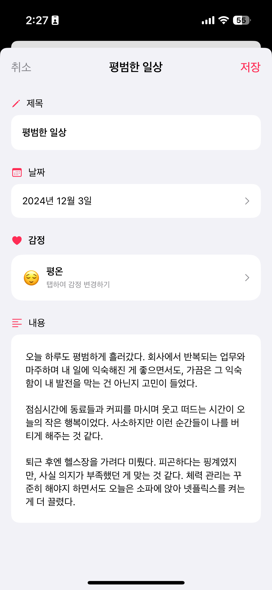

# 📝 How About Now
AI와 함께 쓰는 감정 일기장

하루의 감정을 기록하고 AI가 분석해주는 새로운 방식의 일기장 서비스

  

## 📱 Screenshots

  
  
  

## 📱 Features
- 일기 작성 및 관리
- GPT 감정 분석
- 감정 시각화
- 일기 요약

## 🛠 Development Environment
- iOS 16.0+
- Xcode 15.0+
- Swift 5.9+

## ✏️ Project Architecture
Clean Architecture + MVVM

## 🎁 Dependencies
- OpenAI
- SwiftUI
- Combine
